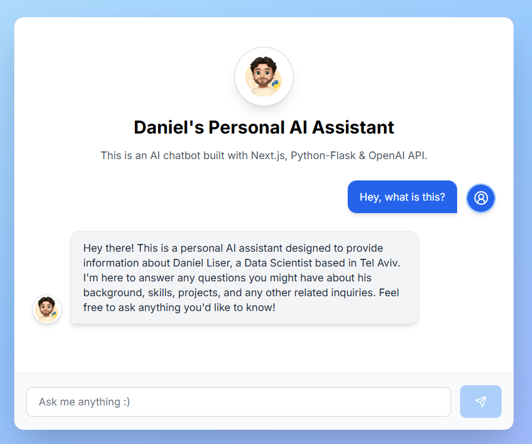

# Daniel's Personal AI Assistant - Chatbot Backend
<br>
Link to visit and interact with this project: https://v0-amazon-bedrock-chatbot-jade-five.vercel.app/<br><br>
This repository contains the backend for my personal AI assistant — a project that introduces who I am and what I do in an interactive way. The chatbot is designed to answer questions about me, my experience, and the technologies I work with. It runs on Flask and communicates with OpenAI's language model to generate responses in real time.

I built this backend to support a React-based frontend (hosted on Vercel), and I deployed the Flask server using Render. This project is part of my broader portfolio, where I explore ways to combine machine learning, automation, and user-friendly design.

---

## What this project is

It's more than just a chatbot. It’s a compact representation of my work ethic: clean code, clear communication, and thoughtful design. The assistant is friendly, informative, and built to help others get to know me — whether they’re recruiters, collaborators, or just curious visitors.

---

## Tech Overview

- **Language & Framework**: Python (Flask)
- **AI Integration**: OpenAI Chat Completion API (GPT-4)
- **Frontend**: Built separately with React + Node.js via Vercel (hosted)
- **Deployment**: Flask backend hosted on Render
- **Tools & Libraries**: `requests`, `python-dotenv`, `dnspython`, and more

---

## File Structure

```
chatbot-backend/
├── app.py               # Flask server with OpenAI integration
├── config.py            # API key and config loader
├── system_prompt.txt    # Persistent system message used to instruct the chatbot
├── requirements.txt     # Python dependencies
├── runtime.txt          # Runtime specification for Render
├── README.md
├── preview.png 
```

---

## How to run locally

If you want to run this locally or experiment with your own assistant, here’s how:

1. Clone the repository:
   ```bash
   git clone https://github.com/your-username/chatbot-backend.git
   cd chatbot-backend
   ```

2. Create a virtual environment:
   ```bash
   python -m venv venv
   source venv/bin/activate      # On Windows: venv\Scripts\activate
   ```

3. Install the dependencies:
   ```bash
   pip install -r requirements.txt
   ```

4. Add your OpenAI key to a `.env` file:
   ```
   OPENAI_API_KEY=your-key-here
   ```

5. Start the app:
   ```bash
   python app.py
   ```

Once running, you can POST messages to the Flask server and get responses generated using OpenAI's models.

---

## About me

I'm Daniel Liser, a Data Scientist from Tel Aviv with a background in economics and applied mathematics. I’ve led data teams, built automation systems, and spent a lot of time exploring the boundaries between data, software, and user experience. I care deeply about the quality of the things I build — from the backend architecture to the personality of a chatbot.

This project was created from the ground up — backend logic, API integration, deployment, all of it. If you want to chat about the project or something entirely different, feel free to reach out:

**daniliser95@gmail.com**

---

## License

This project is open-source and available for learning and experimentation. If you build something with it, I’d love to hear about it.
